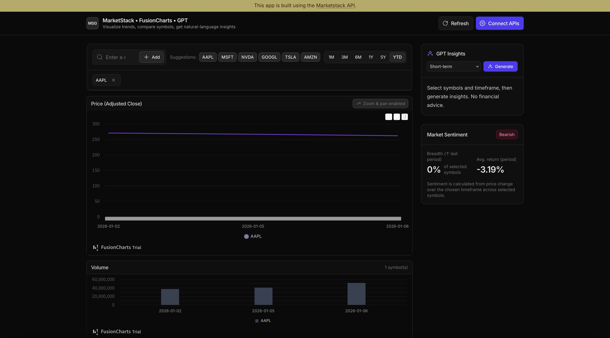

# Stock Market Predictor



A full-stack web application for analyzing and visualizing stock data with MarketStack, FusionCharts, and optional GPT insights. The frontend offers multi-symbol charting, sentiment, and AI commentary, while the backend securely proxies all MarketStack requests.

## Get Started

### 1. Clone the repository

```bash
git clone https://github.com/apilayer/stock-market-predictor.git
cd stock-market-predictor
```

### 2. Install dependencies

Install backend and frontend dependencies separately.

**Backend (Python/Flask)**

```bash
cd backend
python3 -m venv venv
source venv/bin/activate  # Windows: venv\Scripts\activate
pip install -r requirements.txt
```

**Frontend (React/Vite)**

```bash
cd frontend
npm install
```

### 3. Add your API keys

1. Create `.env` in `backend` from the example:
   ```bash
   cd backend
   cp .env.example .env
   ```
2. Add your MarketStack API key to `.env`:
   ```
   MARKETSTACK_API_KEY=your_key_here
   ```
3. (Optional) Add an OpenAI API key in the frontend UI via **Connect APIs**; it is stored locally in the browser.

### 4. Start the servers

**Backend**

```bash
cd backend
source venv/bin/activate
python app.py          # http://localhost:5000
```

**Frontend**

```bash
cd frontend
npm run dev            # http://localhost:5173
```

## Features Implemented

### 1. Market Data & Charts

- Fetch historical EOD/intraday data via backend proxy
- Multi-symbol comparisons with validation
- Timeframe presets: 1M, 3M, 6M, 1Y, 5Y, YTD
- FusionCharts zoomline + volume visuals

### 2. Insights & Sentiment

- GPT-powered insights per selected symbols (optional OpenAI key)
- Sentiment signals using breadth and average return

### 3. Controls & UX

- Add/remove symbols with validation and suggestions
- Refresh data on demand
- Toast feedback for errors and actions
- Responsive dark UI with Tailwind styling

## Tech Stack

### Backend

- **Flask** with **Flask-CORS**
- **requests** for outbound MarketStack calls
- Environment-configured `MARKETSTACK_API_KEY`

### Frontend

- **React 19** with **Vite**
- **Tailwind CSS v4** for styling
- **FusionCharts** for charting
- Custom hooks for MarketStack data

## API Endpoints (backend proxy)

```
GET http://localhost:5000/api/eod?symbols={SYM}&limit=100&sort=DESC
GET http://localhost:5000/api/intraday?symbols={SYM}&interval=1h
GET http://localhost:5000/api/tickers?exchange=NASDAQ&limit=100
GET http://localhost:5000/api/exchanges?limit=100
GET http://localhost:5000/api/currencies?limit=100
GET http://localhost:5000/api/timezones?limit=100
```

Parameters are forwarded and the API key is injected server-side. See `backend/README.md` for full details.

## Usage Flow

1. Start backend (port 5000) and frontend (port 5173).
2. Open `http://localhost:5173`.
3. Add one or more stock symbols (e.g., AAPL, MSFT).
4. Pick a timeframe and view charts.
5. (Optional) Open **Connect APIs** to add OpenAI key, then generate GPT insights.

## Key Components

### Frontend

- **App.jsx** — overall state, data refresh, layout
- **Header** — Connect APIs modal trigger and refresh control
- **ControlPanel** — symbol management and timeframe selection
- **ChartPanel** — FusionCharts price/volume rendering
- **InsightsPanel** — GPT insights workflow
- **SentimentPanel** — derived sentiment metrics
- **ApiModal / Toast** — key capture and feedback

### Backend

- **app.py** — Flask app, CORS setup, and MarketStack proxy routes (`/api/eod`, `/api/intraday`, `/api/tickers`, `/api/exchanges`, `/api/currencies`, `/api/timezones`)

## Notes

- Backend must be running for data requests; frontend proxies `/api/*` to `http://localhost:5000`.
- `.env` is gitignored; never commit secrets.
- MarketStack free tier has request and data freshness limits.
- OpenAI key is optional and stored locally in the browser.

## Future Enhancements

- Backend caching/rate limiting
- Loading and error states on charts
- Saved symbol watchlists
- Server-side GPT proxy option
